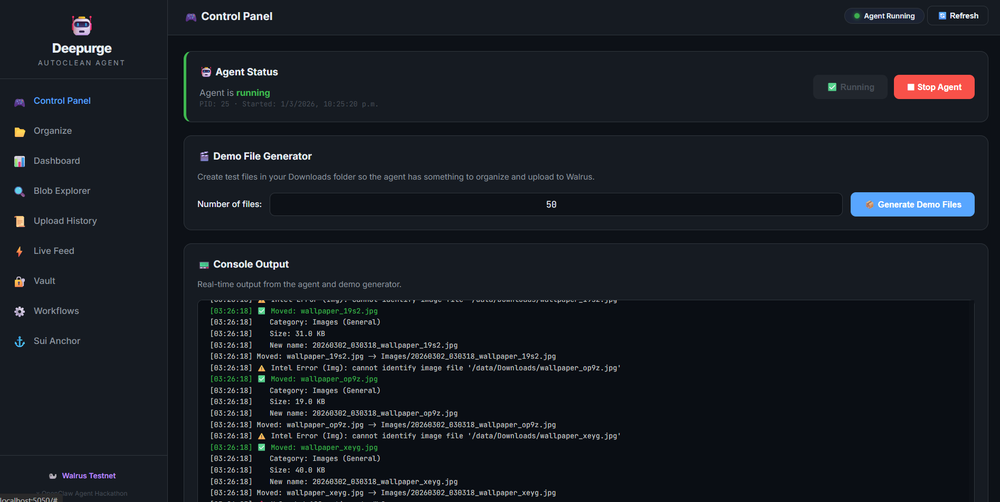
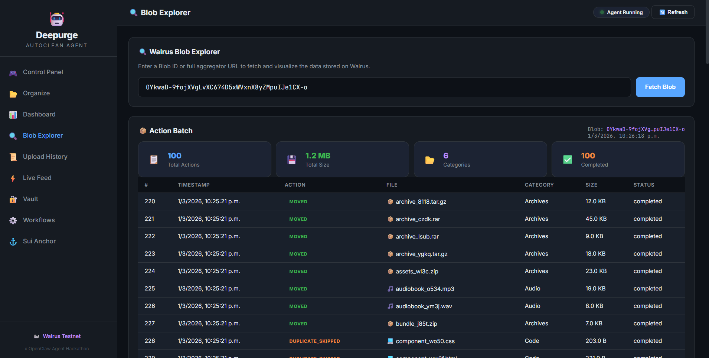

# 🤖 Deepurge AutoClean Agent

<div align="center">


**An autonomous file organization agent with encrypted vault storage, content-aware automation workflows, and on-chain integrity anchoring — powered by Walrus decentralized storage and the Sui blockchain.**

**[Watch the 1-Minute Demo Video](https://youtu.be/6JnrVI59Hbc)**

[Screenshots](#-screenshots) • [Features](#-features) • [Quick Start](#-quick-start) • [Architecture](#-architecture) • [Vault](#-vault--encrypted-walrus-storage) • [Workflows](#-workflows--automation-engine) • [Sui Anchor](#-sui-anchor--on-chain-integrity) • [Deployed Contract](#-deployed-on-sui-testnet)

</div>

---

## 📸 Screenshots

### 🎮 Control Panel – Start/Stop Agent & Generate Demo Files
<p align="center">
  
</p>

### 📊 Dashboard – Live Stats & Category Breakdown
<p align="center">
  
</p>

### 📂 Before – Messy Downloads Folder
<p align="center">
  
</p>

### ✅ After – Agent Organized Everything
<p align="center">
  
</p>

### 🖥️ Agent Processing Files in Real-Time
<p align="center">
  
</p>

### 📊 Dashboard Main View
<p align="center">
  
</p>

### 🔍 Blob Explorer – Browse Walrus Storage
<p align="center">
  
</p>

---

## 👤 Author

**Samuel Campozano Lopez**

- GitHub: [@samuelcampozano](https://github.com/samuelcampozano)
- Email: samuelco860@gmail.com
- Project: x OpenClaw Agent Hackathon

---

## 🎯 Features

### Core Agent

| Feature | Description |
|---------|-------------|
| 📁 **Real-time Monitoring** | Watches Downloads folder using Watchdog library |
| 🧠 **Deep Intelligence** | Analyzes file content (OCR/text extraction) and image metadata for smart sorting |
| 🏷️ **Smart Classification** | Categorizes files by extension and content into sub-categories (Financial, Work, Screenshots, etc.) |
| 📦 **Auto-Organization** | Moves files to organized folders with intelligent timestamps and naming |
| 🔍 **Duplicate Detection** | SHA-256 hash comparison to skip duplicates |
| 💾 **SQLite Logging** | Local database for action history, vault entries, workflow runs, and anchors |
| 🦭 **Walrus Integration** | Logs all actions to Sui blockchain storage in batches |
| 📊 **Daily Reports** | Automatic daily summaries uploaded to Walrus |

### Path 2 — Vault (Encrypted Walrus Storage)

| Feature | Description |
|---------|-------------|
| 🔐 **AES-256-GCM Encryption** | Client-side encryption before upload — Walrus only stores ciphertext |
| 📤 **Single-File Upload** | Encrypt and store any file with one click |
| 📁 **Folder Sync** | Encrypt and upload an entire directory with a single shared key |
| 🔗 **Shareable Links** | URL-fragment-based share links — decryption key never leaves the client |
| 📥 **Decrypt & Download** | Retrieve and decrypt vault files from any browser |
| 🔑 **Key Management** | Keys shown blurred by default, hover to reveal |

### Path 3 — Workflows & Sui Anchor

| Feature | Description |
|---------|-------------|
| ⚙️ **OCR Triggers** | Content-match rules powered by PyMuPDF text extraction |
| 🔄 **File Conversion** | Automatic PNG→PDF conversion, auto-unzip archives |
| 📋 **IF→THEN Rules** | Configurable triggers: content match, extension match, filename match |
| ⚓ **On-Chain Root Hash** | Daily report SHA-256 anchored on Sui Testnet via Move smart contract |
| 🔍 **Integrity Verification** | Anyone can verify report hashes against the on-chain record |
| 📜 **Local Ledger Fallback** | Works without a deployed contract — anchors stored in local JSON ledger |

### Dashboard & Infrastructure

| Feature | Description |
|---------|-------------|
| 🎮 **Control Panel** | Web UI to start/stop the agent, generate demo files, stream live console |
| 📊 **8-View Dashboard** | Control, Dashboard, Blob Explorer, History, Live Feed, Vault, Workflows, Sui Anchor |
| � **Folder Organizer UI** | Browse filesystem, preview files, customize categories, choose rename patterns, run organization |
| �🐳 **Docker Full-Stack** | One container runs both the agent and dashboard — fully portable |
| ⚙️ **Configurable** | JSON-based settings for all parameters |
| 🖥️ **Windows Service Ready** | Can run as scheduled task or service |

---

## 🏗️ Architecture

```
┌─────────────────────────────────────────────────────────────────────────┐
│                       DEEPURGE AUTOCLEAN AGENT                          │
├─────────────────────────────────────────────────────────────────────────┤
│                                                                         │
│  ┌────────────┐  ┌──────────────┐  ┌──────────────┐  ┌─────────────┐  │
│  │  Watchdog  │─▶│  Classifier  │─▶│  Organizer   │─▶│  Workflow   │  │
│  │ (Monitor)  │  │  + Intel AI  │  │   (Move)     │  │  Engine     │  │
│  └────────────┘  └──────────────┘  └──────────────┘  └──────┬──────┘  │
│        │                │                  │                 │         │
│        ▼                ▼                  ▼                 ▼         │
│  ┌────────────────────────────────────────────────────────────────┐    │
│  │                     DATABASE (SQLite)                          │    │
│  │  actions · vault_files · workflow_executions · sui_anchors     │    │
│  └────────────────────────────────────────────────────────────────┘    │
│        │                                          │                    │
│        ▼                                          ▼                    │
│  ┌──────────────────┐                  ┌───────────────────┐          │
│  │   WALRUS LOGGER  │                  │  DEEPURGE VAULT   │          │
│  │  Batch uploads   │                  │  AES-256-GCM      │          │
│  │  Daily reports   │                  │  Encrypted upload  │          │
│  └────────┬─────────┘                  └────────┬──────────┘          │
│           │                                      │                     │
└───────────┼──────────────────────────────────────┼─────────────────────┘
            │                                      │
            ▼                                      ▼
┌───────────────────────────────────────────────────────────┐
│                    WALRUS STORAGE                          │
│                  (Sui Blockchain)                          │
│                                                           │
│  • Immutable action logs    • Encrypted vault files       │
│  • Daily reports            • Folder manifests            │
│  • Session summaries        • Share links (URL fragment)  │
│                                                           │
│  publisher.walrus-testnet.walrus.space                    │
└──────────────────────────┬────────────────────────────────┘
                           │
                           ▼
┌───────────────────────────────────────────────────────────┐
│               SUI TESTNET (Move Contract)                 │
│                                                           │
│  ⚓ deepurge_anchor::Registry                             │
│     Table<date, root_hash> — tamper-proof daily anchors   │
│     AnchorEvent emitted on each anchor                    │
└──────────────────────────┬────────────────────────────────┘
                           │
                           ▼
┌───────────────────────────────────────────────────────────┐
│              🖥️  DEEPURGE DASHBOARD                       │
│             (Flask · http://localhost:5050)                │
│                                                           │
│  🎮 Control Panel      📊 Dashboard & Stats              │
│  🔍 Blob Explorer      📜 Upload History                 │
│  ⚡ Live Feed           🔐 Vault                          │
│  ⚙️ Workflows           ⚓ Sui Anchor                     │
└───────────────────────────────────────────────────────────┘
```

---

## 📋 File Categories

| Category | Extensions | Intelligent Sub-Categories |
|----------|-----------|---------------------------|
| 📸 **Images** | .jpg, .jpeg, .png, .gif, .webp, .svg, .bmp | Screenshots, Landscapes, Portraits |
| 📄 **Documents** | .pdf, .docx, .doc, .txt, .md, .xlsx, .xls | Financial, Work, Academic, Legal |
| 🎬 **Videos** | .mp4, .avi, .mov, .mkv, .wmv, .flv, .webm | General |
| 🎵 **Audio** | .mp3, .wav, .flac, .aac, .ogg, .wma | 🎵 |
| 💻 **Code** | .py, .js, .ts, .html, .css, .java, .json, .sol, .move | 💻 |
| 📦 **Archives** | .zip, .rar, .tar, .gz, .7z | 📦 |
| ⚙️ **Executables** | .exe, .msi, .bat, .cmd, .ps1, .sh | ⚙️ |
| 📁 **Other** | Everything else | 📁 |

---

## 🚀 Quick Start

### Prerequisites

- **Windows 11** (Windows 10 also supported)
- **Python 3.10+** ([Download](https://www.python.org/downloads/))
- **Internet connection** (for Walrus uploads)

### Installation

1. **Clone the repository**
   ```bash
   git clone https://github.com/samuelcampozano/deepurge-autoclean-agent.git
   cd deepurge-autoclean-agent
   ```

2. **Run the installer**
   ```bash
   # Double-click or run:
   install.bat
   ```

3. **Configure settings** (optional)
   ```bash
   # Edit config.json to customize folders and settings
   notepad config.json
   ```

4. **Start the agent**
   ```bash
   run.bat
   ```

### Manual Installation

```bash
# Create virtual environment
python -m venv venv

# Activate (Windows)
venv\Scripts\activate

# Install dependencies
pip install -r requirements.txt

# Run the agent
python agent.py
```

---

## ⚙️ Configuration

Edit `config.json` to customize the agent:

```json
{
    "folders": {
        "watch_folder": "~/Downloads",
        "organized_folder": "~/Downloads/Organized"
    },
    "scan_interval_seconds": 60,
    "walrus": {
        "enabled": true,
        "network": "testnet",
        "upload_batch_size": 100
    },
    "vault": {
        "enabled": true,
        "epochs": 10,
        "auto_backup_on_workflow": true
    },
    "workflows": {
        "enabled": true,
        "auto_unzip": true,
        "screenshot_to_pdf": false,
        "rules": []
    },
    "sui_anchor": {
        "enabled": true,
        "rpc_url": "https://fullnode.testnet.sui.io:443",
        "package_id": "0x9347b087370be9ddda2caad8dfcef4db4500a62c3505691925b5890f9830ee9a",
        "registry_id": "0x95f511bb8ae5b2831c381bcb1aa849ab84f99e839a6a6b88c2e62830f408ea1d",
        "signer_address": "0xf64afb55d7f67645d7542ab066a43b17f309c53c4d083dab1af7629b5007f413"
    }
}
```

### Key Settings

| Setting | Description | Default |
|---------|-------------|---------|
| `watch_folder` | Folder to monitor | `~/Downloads` |
| `organized_folder` | Destination for organized files | `~/Downloads/Organized` |
| `scan_interval_seconds` | How often to check for new files | `60` |
| `upload_batch_size` | Actions before Walrus upload | `100` |
| `check_duplicates` | Enable SHA-256 duplicate detection | `true` |
| `vault.enabled` | Enable encrypted vault storage | `true` |
| `vault.epochs` | Walrus storage epochs for vault files | `10` |
| `workflows.enabled` | Enable OCR-based automation rules | `true` |
| `sui_anchor.package_id` | Deployed Move contract package ID | `0x9347b...ee9a` |

---

## 🦭 Walrus Integration

### Why Walrus Decentralized Storage?

Unlike traditional cloud storage (Google Drive, Dropbox, S3), Walrus on the Sui blockchain provides unique guarantees that make it ideal for file organization audit trails:

| Feature | Traditional Cloud | Walrus on Sui |
|---------|------------------|---------------|
| **Immutability** | Files can be modified or deleted by the provider | ✅ Once stored, data can never be altered or deleted |
| **Censorship Resistance** | Single company controls access | ✅ No single entity can remove your records |
| **Cryptographic Verification** | Trust the provider's word | ✅ Anyone can verify any record at any time |
| **Transparency** | Opaque internal systems | ✅ Every blob is publicly auditable on-chain |
| **Cost Model** | Recurring monthly fees | ✅ Pay once, stored permanently on Sui |
| **Vendor Lock-in** | Tied to one provider | ✅ Open protocol, accessible from anywhere |

**Real-world value:** Your file organization history becomes a permanent, tamper-proof record — perfect for compliance auditing, digital asset management, or simply proving that a specific file existed and was organized at a specific time.

### Data Format

Every file operation is logged to Walrus decentralized storage:

```json
{
    "batch_type": "action_log",
    "timestamp": "2026-02-09T15:30:00Z",
    "action_count": 100,
    "actions": [
        {
            "action": "MOVED",
            "file_name": "vacation_photo.jpg",
            "category": "Images",
            "file_size": 2048576,
            "file_hash": "a1b2c3d4..."
        }
    ],
    "agent": "Deepurge-AutoClean-Agent-v1.0",
    "author": "Samuel Campozano Lopez"
}
```

### Walrus Endpoints (Testnet)

- **Publisher:** `https://publisher.walrus-testnet.walrus.space`
- **Aggregator:** `https://aggregator.walrus-testnet.walrus.space`

Retrieve any log using:
```
https://aggregator.walrus-testnet.walrus.space/v1/{blob_id}
```

---

## 🖥️ Web Dashboard & Control Panel

Deepurge includes a **modern dark-themed web dashboard** with a built-in **Control Panel** to manage the agent directly from your browser.

<p align="center">
  
</p>

### Views

| View | Description |
|------|-------------|
| 🎮 **Control Panel** | Start/stop the agent, generate demo files, live console output streaming |
| 📊 **Dashboard** | Stat cards (files processed, uploads, data size), category chart, recent activity |
| 🔍 **Blob Explorer** | Paste any Walrus blob ID or URL to view the data in a friendly table |
| 📜 **Upload History** | Browse every batch, report & session the agent has uploaded |
| ⚡ **Live Feed** | Auto-refreshing activity feed straight from the local database |
| 🔐 **Vault** | Upload/download encrypted files, folder sync, shareable link generator |
| ⚙️ **Workflows** | Manage IF→THEN automation rules, view execution log, conversion tools |
| ⚓ **Sui Anchor** | View anchored hashes, verify integrity, browse anchor history |
| 📂 **Organize** | Browse filesystem, preview files by category, customize categories/naming, run full organization |

### Quick Start (no Docker)

```bash
# Double-click:
dashboard.bat

# Or manually:
pip install flask flask-cors requests
cd dashboard
python app.py
```

Then open **http://localhost:5050** in your browser.

### 🐳 Docker (Recommended – Full Stack)

One command gives you the **agent + dashboard** in a portable container that mounts your real Downloads folder:

```bash
# Build and run (uses your Downloads folder by default)
docker-compose up --build -d

# Or specify a custom watch folder:
DEEPURGE_WATCH_FOLDER=/path/to/folder docker-compose up --build -d

# Dashboard + Control Panel at http://localhost:5050
```

The Docker container:
- Mounts your **real Downloads folder** so the agent organizes actual files
- Persists the database between restarts via a Docker volume
- Lets you start/stop the agent and generate demo files from the browser
- Works on any machine with Docker installed — **fully portable**

### Try it now with an existing blob

Open the **Blob Explorer** tab and paste:
```
gtkNTOBjo-LeesDwyPfj_KIsRv-uFII0XyIBwpPjp70
```

The dashboard will fetch the data from Walrus and display all 100 file actions in a clean, readable table with stats.

---

## 🔐 Vault — Encrypted Walrus Storage

The Deepurge Vault encrypts files locally with **AES-256-GCM** before uploading to Walrus. The decryption key never touches the network.

### How It Works

1. **Encrypt** — file is encrypted client-side with a 256-bit random key
2. **Upload** — only the ciphertext is sent to Walrus
3. **Share** — a URL-safe link encodes `blob_id + key + nonce` in the URL fragment (`#`), which is never sent to the server
4. **Decrypt** — recipient opens the link, the dashboard downloads ciphertext and decrypts in-browser

### Share Link Anatomy

```
http://localhost:5050/vault/share#eyJiIjoiYmxvYl8xMjM...
                                  └── base64({ blob_id, key, nonce, filename })
                                      ↑ URL fragment — never sent to server
```

### Folder Sync

Encrypt and upload an entire folder with a single key. A root hash (SHA-256 of all file hashes) is computed for integrity verification.

---

## ⚙️ Workflows — Automation Engine

OCR-powered IF→THEN rules that fire automatically when the agent processes a file.

### Built-in Rules

| Rule | Trigger | Actions |
|------|---------|---------|
| **Expenses Trigger** | Content matches `total due`, `invoice total`, etc. | Move to `Expenses/`, tag `expense`, Walrus backup |
| **Receipt Auto-Save** | Content matches `receipt`, `payment received`, etc. | Move to `Receipts/`, Walrus backup |
| **Auto-Unzip Archives** | Extension is `.zip` | Extract to folder |
| **Screenshot to PDF** | Filename matches `screenshot`, `snip`, etc. | Convert PNG→PDF *(disabled by default)* |

### Custom Rules

Add rules via the dashboard or API:

```json
{
    "name": "Tax Documents",
    "trigger_type": "content_match",
    "trigger_value": "w-2|1099|tax\\s*return",
    "actions": [
        {"type": "move", "destination": "Taxes"},
        {"type": "walrus_backup", "value": "true"}
    ],
    "enabled": true
}
```

### Supported Actions

| Action | Description |
|--------|-------------|
| `move` | Move file to a named subfolder |
| `tag` | Tag with a label (logged in DB) |
| `walrus_backup` | Encrypt and upload to Vault |
| `unzip` | Extract ZIP archive |
| `convert_to_pdf` | Convert image to PDF |

---

## ⚓ Sui Anchor — On-Chain Integrity

Each daily report's SHA-256 root hash is anchored on the Sui blockchain, creating a tamper-proof audit trail.

### Move Smart Contract

```move
module deepurge_anchor::deepurge_anchor {
    public struct Registry has key {
        id: UID,
        owner: address,
        entries: Table<vector<u8>, vector<u8>>,  // date → root_hash
        anchor_count: u64,
    }

    public entry fun anchor_report(
        registry: &mut Registry,
        date: vector<u8>,
        root_hash: vector<u8>,
        ctx: &mut TxContext,
    ) { /* ... */ }
}
```

### Verification

Anyone can verify that a daily report hasn't been tampered with:

1. Open the **Sui Anchor** tab in the dashboard
2. Enter the report date and root hash
3. The system checks against the on-chain record (or local ledger)

### Fallback Mode

When no Move contract is deployed (i.e. `package_id` is empty), anchors are stored in a local JSON ledger (`anchor_ledger.json`). This allows the full workflow to function during development and testing.

---

## 🎬 Demo Video

> 🎥 **[Watch the 1-Minute Demo Video on YouTube](https://youtu.be/6JnrVI59Hbc)**

### Generate Demo Files

```bash
# Create 50 test files in Downloads
demo.bat

# Or manually:
python demo_generator.py ~/Downloads 50
```

---

## 📊 Usage Example

```
╔════════════════════════════════════════════════════════════════════╗
║   DEEPURGE AUTOCLEAN AGENT                                         ║
║   🤖 Sui Hackathon 2026                                            ║
║   👤 Author: Samuel Campozano Lopez                                ║
║   🦭 Powered by Walrus Decentralized Storage                       ║
╚════════════════════════════════════════════════════════════════════╝

🚀 Starting Deepurge AutoClean Agent...
   Watch Folder: C:\Users\Samuel\Downloads
   Organized Folder: C:\Users\Samuel\Downloads\Organized
   Walrus Network: testnet

📁 Setting up folders...
   ✓ C:\Users\Samuel\Downloads\Organized\Images
   ✓ C:\Users\Samuel\Downloads\Organized\Documents
   ✓ C:\Users\Samuel\Downloads\Organized\Videos
   ✅ Folders ready!

🔍 Scanning existing files...

✅ Moved: invoice_9921.pdf
   Category: Documents (Financial)
   Size: 156.2 KB
   New name: 20260212_Financial_Invoice_invoice_9921.pdf

✅ Moved: desktop_screenshot.png
   Category: Images (Screenshots)
   Size: 2.5 MB
   New name: 20260212_Screenshots_desktop_screenshot.png

📤 Uploaded 100 actions to Walrus
   Blob ID: 7Xk9...abc123

👁️  Watching for new files...
   Press Ctrl+C to stop
```

---

## 🛠️ Project Structure

```
deepurge-autoclean-agent/
├── 📄 agent.py              # Main agent – monitoring, organizing, workflows & Walrus uploads
├── 📄 classifier.py         # File classification by extension + Deep Intelligence
├── 📄 intelligence.py       # OCR/text extraction and image analysis for smart sorting
├── 📄 database.py           # SQLite operations (actions, vault, workflows, anchors)
├── 📄 walrus_logger.py      # Walrus decentralized storage integration
├── 📄 vault.py              # [Path 2] AES-256-GCM encrypted file storage on Walrus
├── 📄 workflows.py          # [Path 3] OCR triggers, IF→THEN rules, file conversion
├── 📄 sui_anchor.py         # [Path 3] On-chain root hash anchoring via Sui JSON-RPC
├── 📄 demo_generator.py     # Generate test files across categories
├── 📄 config.json           # Agent configuration (all features)
├── 📄 config.docker.json    # Docker configuration (watch /data/Downloads)
├── 📄 requirements.txt      # Python dependencies
├── 📄 install.bat           # Windows installer
├── 📄 run.bat               # Start agent script
├── 📄 demo.bat              # Demo file generator script
├── 📄 dashboard.bat         # Dashboard launcher (local)
├── 📄 Dockerfile.dashboard  # Full-stack Docker image (agent + dashboard)
├── 📄 docker-compose.yml    # Docker Compose – mounts real Downloads folder

├── 📁 contracts/            # Sui Move smart contract (deployed to testnet)
│   └── 📁 deepurge_anchor/
│       ├── 📄 Move.toml
│       └── 📁 sources/
│           └── 📄 deepurge_anchor.move   # On-chain date→hash registry
├── 📁 dashboard/            # Web dashboard + Control Panel (8 views)
│   ├── 📄 app.py            # Flask backend + Vault/Workflow/Anchor APIs
│   ├── 📄 requirements.txt  # Dashboard dependencies
│   ├── 📁 templates/
│   │   └── 📄 index.html    # Main dashboard page (8 views)
│   └── 📁 static/
│       ├── 📁 css/style.css  # Dark theme stylesheet (vault, workflow, anchor styles)
│       └── 📁 js/app.js      # Frontend logic + vault/workflow/anchor interactions
├── 📁 img/                  # Screenshots for README
├── 📄 README.md             # This file
└── 📄 .gitignore            # Git ignore rules
```

---

## 🔧 Running as Windows Service

### Using Task Scheduler

1. Open **Task Scheduler** (taskschd.msc)
2. Create Basic Task → "Deepurge AutoClean Agent"
3. Trigger: "When the computer starts"
4. Action: Start a program
   - Program: `C:\path\to\venv\Scripts\pythonw.exe`
   - Arguments: `agent.py`
   - Start in: `C:\path\to\deepurge-autoclean-agent`
5. Finish and enable

### Using NSSM (Recommended)

```bash
# Install NSSM
choco install nssm

# Create service
nssm install DeepurgeAgent "C:\path\to\venv\Scripts\python.exe" "agent.py"
nssm set DeepurgeAgent AppDirectory "C:\path\to\deepurge-autoclean-agent"
nssm set DeepurgeAgent Start SERVICE_AUTO_START

# Start service
nssm start DeepurgeAgent
```

---

## 🤝 Contributing

Contributions are welcome! Please feel free to submit a Pull Request.

1. Fork the repository
2. Create your feature branch (`git checkout -b feature/amazing-feature`)
3. Commit your changes (`git commit -m 'Add amazing feature'`)
4. Push to the branch (`git push origin feature/amazing-feature`)
5. Open a Pull Request

---

## 📜 License

MIT License - feel free to use this project for any purpose.

---

## 🏆 Built for x OpenClaw Agent Hackathon

This project demonstrates deep integration with:

- **Walrus Storage** — Decentralized blob storage on Sui (action logs, encrypted vault, reports)
- **Sui Network** — Layer 1 blockchain with Move smart contract for on-chain anchoring
- **AES-256-GCM** — Client-side encryption for vault storage (key never leaves the client)
- **Python Ecosystem** — Watchdog, PyMuPDF, Pillow, Flask
- **Web Dashboard** — 8-view dark-themed UI with full vault, workflow, and anchor management

### Hackathon Requirements Met

✅ Monitor Downloads folder (real filesystem via Docker volumes)  
✅ Classify files automatically into 7 categories with intelligent sub-categories  
✅ Move & rename to organized folders with smart timestamps  
✅ Log all actions to Walrus decentralized storage  
✅ Web dashboard with stat cards, charts & Walrus blob explorer  
✅ Control Panel UI to start/stop agent & generate demo files  
✅ Full-stack Docker containerization (agent + dashboard)  
✅ **Path 2: Vault** — AES-256-GCM encrypted file storage on Walrus with shareable links  
✅ **Path 3: Flow** — OCR-based automation workflows + Sui on-chain root hash anchoring  
✅ Move smart contract for tamper-proof daily report integrity  
✅ README with author name, screenshots & documentation  
✅ Clean, documented, modular code  
✅ Demo file generator with intelligence triggers  
✅ Windows 11 compatible  

---

<div align="center">

**Made with ❤️ by Samuel Campozano Lopez**

[⭐ Star this repo](https://github.com/samuelcampozano/deepurge-autoclean-agent) | [🐛 Report Bug](https://github.com/samuelcampozano/deepurge-autoclean-agent/issues) | [✨ Request Feature](https://github.com/samuelcampozano/deepurge-autoclean-agent/issues)

**🦭 Powered by Walrus Decentralized Storage on Sui**

</div>

---

## 🔗 Deployed on Sui Testnet

The Move smart contract is **live on Sui Testnet** with active on-chain anchor transactions:

| Resource | Address |
|----------|--------|
| **Package** | [`0x9347b087370be9ddda2caad8dfcef4db4500a62c3505691925b5890f9830ee9a`](https://suiscan.xyz/testnet/object/0x9347b087370be9ddda2caad8dfcef4db4500a62c3505691925b5890f9830ee9a) |
| **Registry** | [`0x95f511bb8ae5b2831c381bcb1aa849ab84f99e839a6a6b88c2e62830f408ea1d`](https://suiscan.xyz/testnet/object/0x95f511bb8ae5b2831c381bcb1aa849ab84f99e839a6a6b88c2e62830f408ea1d) |
| **Publisher** | [`0xf64afb55d7f67645d7542ab066a43b17f309c53c4d083dab1af7629b5007f413`](https://suiscan.xyz/testnet/account/0xf64afb55d7f67645d7542ab066a43b17f309c53c4d083dab1af7629b5007f413) |

The agent computes a SHA-256 root hash of all daily file actions and anchors it on-chain via the `anchor_report` function — creating a **tamper-proof audit trail** that anyone can verify.
